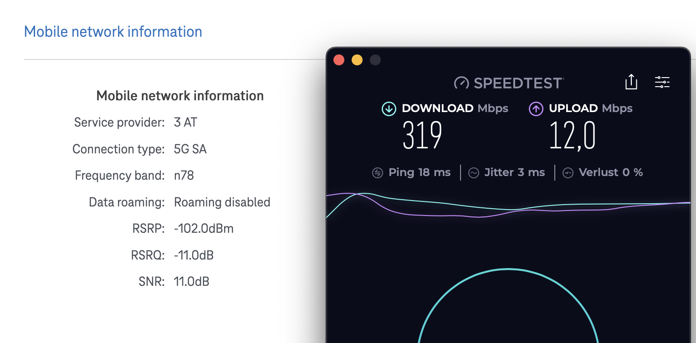

# Unlock Band n75 + Standalone Bands

The built-in Quectel RG520N-EB module is delivered and calibrated with R01 firmware. Flashing R03 firmware results in a CFUN: 7 error and is therefore not recommended. The lack of a USB port makes it difficult to import a compatible QCN file to calibrate the modem with the R03 firmware and return it to CFUN: 1 status. Cross-flashing is therefore strongly discouraged!

By default, the firmware deactivates all SA bands and does not include the n75 band. The bands can be activated via AT command. The modem can then be operated without any problems, for example in standalone mode (with all the advantages and disadvantages that this entails).

The bands can be enabled via at+command. The default configuration is written again with every restart. It is therefore necessary to create a startup script to unlock the bands again and again.

Since neither minicom nor screen is installed, it makes sense to open a terminal window to read the result of AT commands and a second terminal window to send AT commands

Terminal window for reading the commands:

```cat /dev/ttyUSB2```

Terminal Window for sending commands:
```
Display all possible bands:
echo -e 'AT+QNWPREFCFG="ue_capability_band"\r' > /dev/ttyUSB2

Enable Standalone (Bands):
echo -e 'AT+QNWPREFCFG="nr5g_disable_mode",0\r' > /dev/ttyUSB2

Enable Band n75 5G_NSA:
echo -e 'AT+QNWPREFCFG="nr5g_band",1:3:7:28:38:75:78\r' > /dev/ttyUSB2

Enable Band n75 5G_SA:
echo -e 'AT+QNWPREFCFG="nsa_nr5g_band",1:3:7:28:38:75:78\r' > /dev/ttyUSB2
```

I was not able to test whether the router also connects to band n75, as it is not yet activated here. Standalone works without any problems.




## Persistent Band-Unlock

Permanent root access must be installed using XMIR-Patcher. If this has not yet been done, there is no need to read any further. 
To make the band unlock persistent, I use a mechanism similar to ssh_patch. Since it is not enough to unlock the bands only during a reboot, I have linked the unlock mechanism to the activation of the modem network interface. This approach yielded the best results. To do this, two new files must be created and one file must be edited.

1. Copy file 5g_band_patch.sh to: 
   ```/data/etc/crontabs/patches/5g_band_patch.sh```
   
2. Create hooks directory: 
   ```mkdir -p /data/custom/hooks/```
   
3. Copy file 99-set-5g-bands to: 
   ```/data/custom/hooks/99-set-5g-bands```
   
4. Make both files executable:
    ```
   chmod 755 /data/custom/hooks/99-set-5g-bands /data/etc/crontabs/patches/5g_band_patch.sh

   chmod a+x /data/custom/hooks/99-set-5g-bands /data/etc/crontabs/patches/5g_band_patch.sh
   ```
5. Add entry to the end of  ```/etc/config/firewall```:
   ```
   config include 'auto_ssh_patch'
        option type 'script'
        option path '/etc/crontabs/patches/5g_band_patch.sh'
        option enabled '1'
    ```
