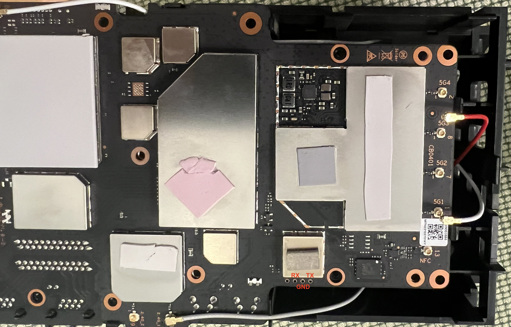

# UART + Inner Life

## UART



PIN 1: VCC
PIN 2: RX
PIN 3: GND
PIN 4: TX

## Bootloader-Log

```
Format: Log Type - Time(microsec) - Message - Optional Info
Log Type: B - Since Boot(Power On Reset),  D - Delta,  S - Statistic
S - QC_IMAGE_VERSION_STRING=BOOT.BF.3.3.1.1-00067
S - IMAGE_VARIANT_STRING=MAACANAZA
S - OEM_IMAGE_VERSION_STRING=CRM
S - Boot Config, 0x000002c5
B -       127 - PBL, Start
B -      1561 - bootable_media_detect_entry, Start
B -      3351 - bootable_media_detect_success, Start
B -      3354 - elf_loader_entry, Start
B -      8483 - auth_hash_seg_entry, Start
B -     29461 - auth_hash_seg_exit, Start
B -    121337 - elf_segs_hash_verify_entry, Start
B -    190944 - PBL, End
B -    156343 - SBL1, Start
B -    217739 - GCC [RstStat:0x0, RstDbg:0x600000] WDog Stat : 0x4
B -    225913 - clock_init, Start
D -      7442 - clock_init, Delta
B -    233508 - boot_flash_init, Start
D -     14975 - boot_flash_init, Delta
B -    248544 - boot_config_data_table_init, Start
D -      4666 - boot_config_data_table_init, Delta - (575 Bytes)
B -    256291 - Boot Setting :  0x00000618
B -    262635 - CDT version:2,Platform ID:8,Major ID:4,Minor ID:0,Subtype:3
B -    269376 - sbl1_ddr_set_params, Start
B -    270809 - Pre_DDR_clock_init, Start
B -    276665 - Pre_DDR_clock_init, End
B -    918690 - do ddr sanity test, Start
D -        61 - do ddr sanity test, Delta
B -    923357 - Image Load, Start
D -    253150 - QSEE Image Loaded, Delta - (586580 Bytes)
B -   1177361 - Image Load, Start
D -     23942 - DEVCFG Image Loaded, Delta - (19992 Bytes)
B -   1201364 - Image Load, Start
D -    191296 - APPSBL Image Loaded, Delta - (440117 Bytes)
B -   1392752 - QSEE Execution, Start
D -        30 - QSEE Execution, Delta
B -   1399218 - SBL1, End
D -   1245345 - SBL1, Delta
S - Flash Throughput, 2459 KB/s  (1047936 Bytes,  426018 us)
S - DDR Frequency, 800 MHz
S - Core 0 Frequency, 800 MHz
```