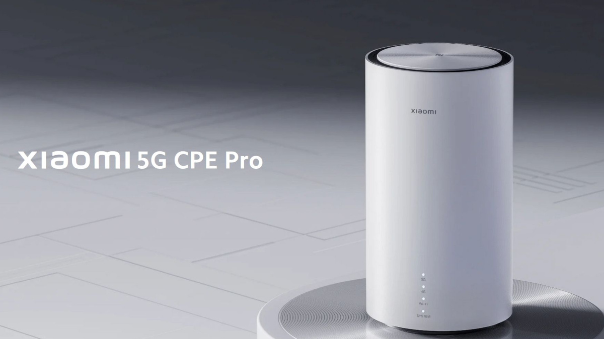

# Xiaomi AX5400 CB0401 v1 Collection

## Unlock 5G Standalone + Band n75

To unlock standalone mode and band n75 follow these instructions: 

[Band Unlock](Band_Unlock/README.md)

## UART Serial Connector + Bootloader Log + Inner Life

A collection of pictures from the inside are available here:

[UART + Bootloader](Inner_Life/README.md)

## Downgrade Scripts

By using these scripts you can downgrade or flash any firmware you want. Think twice if you want to take the risk!

[Downgrade](Downgrade/README.md)

## Changing the Quectel RG520N Revision

#### tl;dr: don't try.

I was not able to change the modem revision from R01 (CB0401 v1) to R03 (CB0401 v2). 
Forcing to install a R03 firmware via QFirehose (which is available on stock firmware) leads to CFUN=7. The reason could be because I did not force to remove all nv item and therefore the calibration data are wrong in this moment. Since I was not able to backup the efs partition and nv values, I didn't try to delete all nv items and run the R03 firmware. 

I was able to retrieve CFUN=1 again by frankensteining the RG520N R03 firmware upgrade file. I replaced the NON-HLOS.ubi file inside of the upgrade binary with the R01 NON-HLOS.ubi. This was necessary since Quectel does not hand out the modem upgrade files for the built in modem. If someone has it: Please send it to me. After this, the modem is working again, but you are not able to use stock firmware upgrade files anymore since they fail to upgrade the modem with the standard flash script. You have to use the frankenstein method with the NON-HOLS file again and disable modem flashing in the flashing script.

